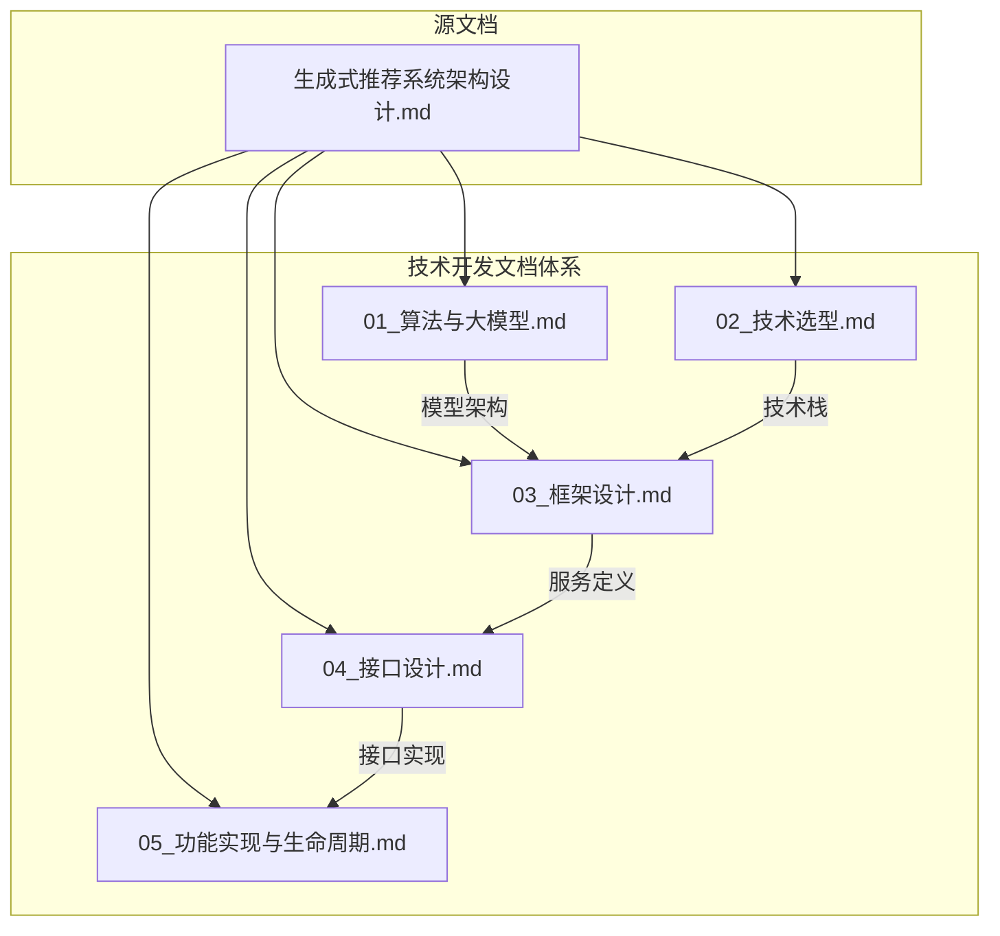

# 生成式推荐系统技术开发文档计划

基于 [docs/生成式推荐系统架构设计.md](docs/生成式推荐系统架构设计.md) 产出5份完整技术开发文档。---

## 文档产出清单

| 序号 | 文档名称 | 文件路径 | 预估篇幅 ||------|----------|----------|----------|| 1 | 算法与大模型技术文档 | `docs/dev/01_算法与大模型.md` | ~2500行 || 2 | 技术选型文档 | `docs/dev/02_技术选型.md` | ~800行 || 3 | 框架设计文档 | `docs/dev/03_框架设计.md` | ~1500行 || 4 | 接口设计文档 | `docs/dev/04_接口设计.md` | ~1200行 || 5 | 功能实现与全生命周期指导 | `docs/dev/05_功能实现与生命周期.md` | ~1500行 |---

## 各文档详细内容规划

### 文档1: 算法与大模型技术文档

**对应架构文档**: 第三章(UGT模型)、第四章(数据流)、第五章(冷启动)、第八章(训练)**核心内容**:

1. **生成式推荐模型架构**

- UGT (Unified Generative Transformer) 完整结构
- Semantic ID 编码器实现细节 (RQ-VAE)
- 点积聚合注意力 (HSTU) 代码实现
- MoE FFN 层设计
- GLN (Group Layer Norm) 实现

2. **训练流程**

- 三阶段训练: Semantic ID预训练 -> NTP预训练 -> DPO对齐
- 分布式训练配置 (DeepSpeed ZeRO-3)
- 损失函数: L_ntp + L_contrastive + L_preference
- 超参数配置表

3. **推理流程**

- M-FALCON 加速策略实现
- 级联过滤: 1000 -> 100 -> 10
- 用户历史压缩算法
- TensorRT 优化配置

4. **特征工程方案**

- 事件序列化 (Event Tokenization) 规范
- Token 类型分组: User/Action/Item/Context
- 多模态特征融合策略
- 特征存储与更新机制

5. **大模型接入方案**

- LLM 冷启动服务实现
- Prompt 工程: 物品理解、用户画像、相似推理
- 上下文窗口管理 (滑动窗口/摘要压缩)
- API 调用封装 (支持 Qwen/Llama/本地部署)

---

### 文档2: 技术选型文档

**对应架构文档**: 第十章(10.2技术栈选型)、第六章(推理加速)、第七章(高并发)**核心内容**:

1. **前端技术选型**

| 组件 | 选型 | 选型理由 ||------|------|----------|| 用户端框架 | Vue 3 + Vite | 轻量、快速开发、生态成熟 || 管理后台 | Vue 3 + Ant Design Vue | 企业级组件库、开箱即用 || 状态管理 | Pinia | 官方推荐、TypeScript友好 || HTTP客户端 | Axios | 拦截器支持、社区活跃 || 可视化 | ECharts + Three.js | 推荐效果可视化 |

2. **后端技术选型 (Go语言栈)**

| 组件 | 选型 | 选型理由 ||------|------|----------|| HTTP框架 | Gin | 高性能、中间件丰富 || RPC框架 | gRPC | 高效序列化、服务间通信 || ORM | GORM | Go生态最成熟 || 依赖注入 | Wire | Google官方、编译期检查 || 配置管理 | Viper | 多格式支持、热更新 || 日志 | Zap | 高性能结构化日志 |

3. **数据库技术选型**

| 用途 | 选型 | 选型理由 ||------|------|----------|| 主数据库 | PostgreSQL 16 | 成熟稳定、pgvector扩展支持向量 || 向量检索 | Milvus | 专业向量数据库、免费开源 || 缓存层 | Redis 7 Cluster | 特征缓存、会话状态 || 时序/日志 | ClickHouse | 行为日志、OLAP分析 || 对象存储 | MinIO | S3兼容、模型文件存储 |

4. **算法框架选型**

| 组件 | 选型 | 选型理由 ||------|------|----------|| 训练框架 | PyTorch 2.x | 动态图、生态丰富 || 分布式训练 | DeepSpeed | ZeRO优化、MoE支持 || 推理优化 | TensorRT | GPU推理加速 || 模型服务 | Triton Inference Server | 多模型管理、动态批处理 |

5. **基础设施选型**

| 组件 | 选型 | 选型理由 ||------|------|----------|| 容器编排 | Kubernetes | 行业标准 || 服务网格 | Istio | 流量管理、灰度发布 || 消息队列 | Kafka | 高吞吐、持久化 || 监控 | Prometheus + Grafana | 免费、生态完善 || 链路追踪 | Jaeger | OpenTelemetry兼容 |---

### 文档3: 框架设计文档

**对应架构文档**: 第二章(整体架构)、第七章(分布式服务架构)**核心内容**:

1. **前端框架设计**

- 用户端架构:
     ```javascript
               src/
               ├── views/           # 页面组件
               │   ├── Home/        # 推荐首页
               │   ├── Detail/      # 详情页
               │   └── Search/      # 搜索页
               ├── components/      # 通用组件
               ├── stores/          # Pinia状态
               ├── api/             # API封装
               └── utils/           # 工具函数
     ```


- 管理后台架构
- 状态管理: 用户状态、推荐列表、缓存策略
- 交互流程图 (Mermaid)

2. **后端框架设计 (Go微服务)**

- 服务划分:
     ```javascript
               services/
               ├── gateway/         # API网关 (Gin)
               ├── user-service/    # 用户服务
               ├── rec-service/     # 推荐服务 (核心)
               ├── feature-service/ # 特征服务
               ├── model-service/   # 模型推理服务
               └── admin-service/   # 管理后台服务
     ```


- 核心模块设计: 推荐服务内部分层 (Handler/Service/Repository)
- 中间件设计: 认证、限流、熔断、链路追踪
- 服务间通信: gRPC + Protobuf 定义

3. **数据库框架设计**

- 存储分层:
     ```javascript
               热数据 (Redis)     -> 用户实时特征、Session
               温数据 (PostgreSQL) -> 用户画像、物品元数据
               冷数据 (ClickHouse) -> 行为日志、训练数据
               向量数据 (Milvus)   -> Semantic ID、Embedding
     ```


- 核心表结构设计 (用户表、物品表、行为表、特征表)
- 索引设计: B-Tree索引、GIN索引(全文)、向量索引(HNSW)
- 分库分表策略: 用户ID哈希分片

---

### 文档4: 接口设计文档

**对应架构文档**: 第二章(在线服务层)、第六章(延迟分解)**核心内容**:

1. **用户端API**

- `POST /api/v1/recommend` - 获取推荐列表
- `POST /api/v1/feedback` - 用户反馈(点击/跳过)
- `GET /api/v1/item/{id}` - 获取物品详情
- `GET /api/v1/similar/{id}` - 相似推荐

2. **管理后台API**

- `GET /admin/api/v1/dashboard` - 监控面板
- `POST /admin/api/v1/model/deploy` - 模型部署
- `GET /admin/api/v1/ab-test` - A/B测试管理
- `POST /admin/api/v1/cold-start` - 冷启动配置

3. **内部服务API (gRPC)**

- `FeatureService.GetUserFeature` - 获取用户特征
- `ModelService.Predict` - 模型推理
- `ColdStartService.GenerateRepresentation` - 冷启动生成

4. **接口规范**

- 统一响应格式: `{code, message, data, trace_id}`
- 错误码定义: 1xxxx(系统)、2xxxx(业务)、3xxxx(模型)
- 限流配置: 推荐接口 10000 QPS/实例
- SLA指标: P99 < 50ms

---

### 文档5: 功能实现与全生命周期指导

**对应架构文档**: 第五章(冷启动)、第六章(推理加速)、第九章(评估)、第十章(实施路线图)**核心内容**:

1. **核心功能实现**

- 推荐生成流程: 特征获取 -> 模型推理 -> 重排 -> 返回
- 冷启动实现: LLM理解 -> 语义ID生成 -> 近邻迁移
- 实时反馈: Kafka消费 -> 特征更新 -> 近线重算
- 关键代码片段 (Go/Python伪代码)
- 异常处理: 降级策略、兜底推荐

2. **开发阶段规范**

- Git分支策略: main/develop/feature/hotfix
- 代码评审: 必须2人Approve、CI通过
- 单元测试: 覆盖率 >= 80%
- 代码规范: Go使用golangci-lint、Python使用ruff

3. **测试阶段规范**

- 单元测试: Go testing + testify
- 集成测试: Docker Compose环境
- 性能测试: wrk/locust、目标 10000 QPS
- 压测标准: P99 < 50ms, 错误率 < 0.1%

4. **部署阶段规范**

- 环境划分: dev/staging/prod
- CI/CD: GitHub Actions / GitLab CI
- Helm Chart: 服务编排
- 配置管理: ConfigMap + Secret

5. **运维阶段规范**

- 监控指标: QPS、延迟、GPU利用率、模型推理成功率
- 日志收集: Filebeat -> Kafka -> ClickHouse
- 告警规则: P99 > 40ms、错误率 > 0.05%
- 故障预案: 模型降级、流量切换、数据回滚

6. **上线阶段规范**

- 灰度策略: 5% -> 20% -> 50% -> 100%
- 回滚机制: 一键回滚、自动回滚触发条件
- 验收标准: 核心指标无下降、无P0故障

---

## 文档架构图示



---

## 执行计划

| 步骤 | 任务 | 预估时间 ||------|------|----------|| 1 | 创建 `docs/dev/` 目录 | 1分钟 || 2 | 编写 `01_算法与大模型.md` | 15分钟 || 3 | 编写 `02_技术选型.md` | 8分钟 || 4 | 编写 `03_框架设计.md` | 12分钟 || 5 | 编写 `04_接口设计.md` | 10分钟 || 6 | 编写 `05_功能实现与生命周期.md` | 12分钟 |---

## 约束遵循检查

- [x] 所有设计基于《生成式推荐系统架构设计》文档
- [x] 后端使用 Go 语言
- [x] 前端使用轻量级成熟框架 (Vue 3)
- [x] 数据库选用免费开源方案