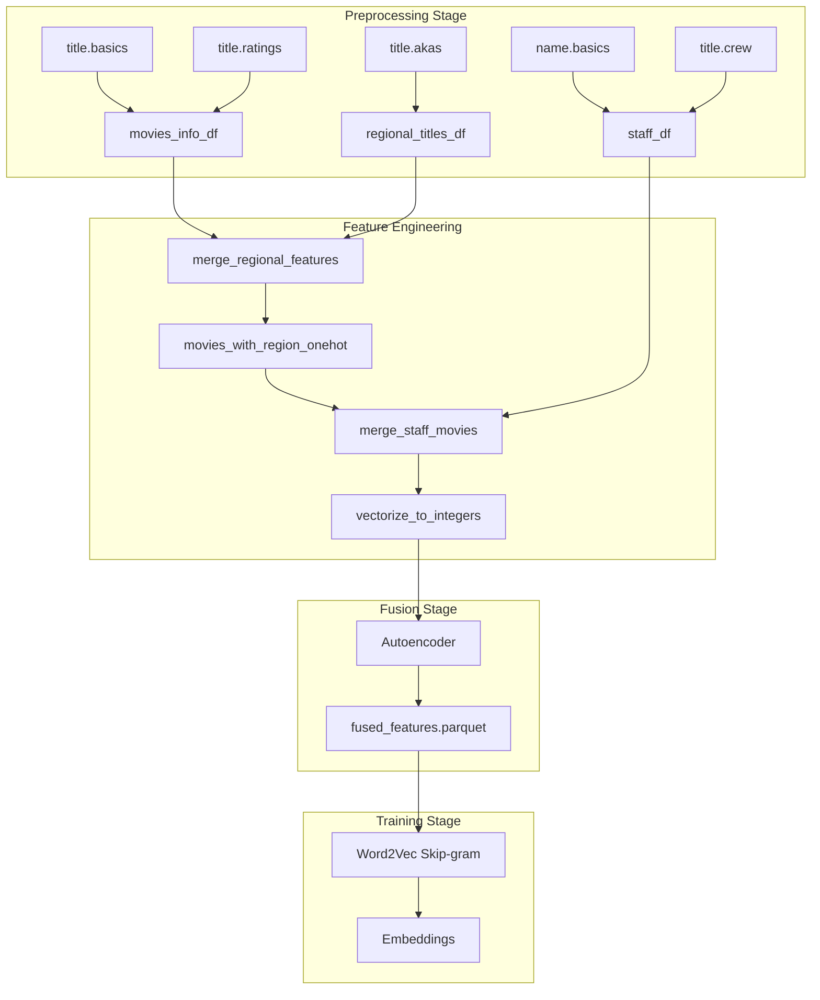
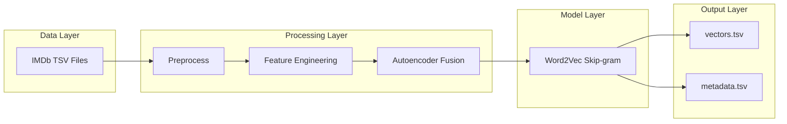

# 电影推荐系统设计与优化

_Exported on 2025/12/17 at GMT+8 13:31:24 from Cursor (2.2.23)_

---

**User**

1. 为代码的训练和推理部分，增加 tqdm 可视化进度，方便开发者查看。为 @imdb_word2vec/requirements.txt 中添加 tensorflow-metal，提升训练速度。因此，你还需要去修改 @imdb_word2vec/imdb_word2vec/ 中相关的源代码，使得代码能利用上 Metal GPU 进行训练加速，且使得整个项目兼容多种环境（NVDIA、Metal GPU、纯 CPU，优先考虑 NVIDA，没有就回退到 Metal GPU，还没有就回退到 CPU）
2. 审查整个源代码文件 @imdb_word2vec/imdb_word2vec/ ，告诉我 title.episode.tsv 和 title.principals.tsv 这两个文件的内容是否有在特征融合阶段和训练阶段被真正的使用。真正的使用的意思是说，我不是单纯的处理它了，而是将其中的特征有意义的进行处理，然后有意义的加入到训练中，目的是提高模型的性能和准确率。
3. 审查整个源代码文件 @imdb_word2vec/ 告诉我，我现在是以什么样的思路进行的特征融合。然后请您思考，如果我要做电影推荐系统，这样的特征融合方式对吗？这样的特征融合方式够吗？
4. 审查整个源代码文件 @imdb_word2vec/ 告诉我，我的这个电影推荐系统，是一个怎样的架构，我的这个推荐系统的技术基座是什么？

---

**Cursor**

I'll read the source code files to understand the current implementation and answer your questions comprehensively.

```python
"title.episode.tsv.gz":"https://datasets.imdbws.com/title.episode.tsv.gz",
"title.principals.tsv.gz":"https://datasets.imdbws.com/title.principals.tsv.gz",
```

Now I have a complete understanding of your codebase. Let me provide a detailed analysis and create a comprehensive plan.

---

## Analysis Results

### Question 2: Are `title.episode.tsv` and `title.principals.tsv` actually used?

**Answer: NO, they are NOT used at all.**

Looking at the code:

1. In `config.py` (lines 80-81), these files ARE configured for download:

```python
"title.episode.tsv.gz":"https://datasets.imdbws.com/title.episode.tsv.gz",
"title.principals.tsv.gz":"https://datasets.imdbws.com/title.principals.tsv.gz",
```

2. In `preprocess.py`, only these files are actually processed:
   - `title.basics.tsv.gz` (line 37)
   - `name.basics.tsv.gz` (line 45)
   - `title.akas.tsv.gz` (line 53)
   - `title.crew.tsv.gz` (line 60)
   - `title.ratings.tsv.gz` (line 76)

**`title.episode.tsv` and `title.principals.tsv` are downloaded but NEVER read or processed.** This is a significant waste of resources and missed opportunity:

- `title.principals.tsv` contains **actor-movie casting relationships** (who starred in what movie, in what role)
- `title.episode.tsv` contains TV series episode relationships (less relevant for movies)

---

### Question 3: Current Feature Fusion Approach and Evaluation for Recommendation System

**Current Feature Fusion Strategy:**



**Current approach:**

1. One-hot encode `region` and `types` fields, aggregate by movie
2. Link staff to movies via `knownForTitles`
3. Map all discrete fields (genres, professions, IDs) to integer indices
4. Train autoencoder on vectorized features → output reconstruction
5. Use reconstruction as "fused features" for Word2Vec

**Critical Issues for Recommendation System:**

| Problem                       | Current State                  | Impact                                                                  |
| ----------------------------- | ------------------------------ | ----------------------------------------------------------------------- |
| Autoencoder output            | Uses reconstruction output     | Should use bottleneck (latent) representation for meaningful embeddings |
| No user modeling              | Zero user data                 | Cannot personalize recommendations                                      |
| Missing actor-movie relations | `title.principals.tsv` unused  | Loses key "who starred in what" relationships                           |
| No interaction data           | No ratings/views/clicks        | No collaborative filtering possible                                     |
| Shallow feature fusion        | Simple one-hot + concatenation | Doesn't capture complex relationships                                   |

**Is this sufficient for a movie recommendation system? NO.**

This is an **embedding generation pipeline**, not a recommendation system. It can find similar movies by embedding similarity, but lacks:

- User preference modeling
- Collaborative filtering signals
- Explicit recommendation ranking logic

---

### Question 4: System Architecture and Technical Foundation

**Current Architecture:**



**Technical Foundation:**
| Component | Technology | Purpose |
|-----------|------------|---------|
| Deep Learning Framework | TensorFlow/Keras | Model training |
| Embedding Model | Skip-gram Word2Vec | Learn token embeddings |
| Feature Fusion | Autoencoder (512→256→128) | Compress high-dimensional features |
| Data Processing | Pandas | ETL and feature engineering |

**This is NOT a complete recommendation system.** It's an **embedding pre-training pipeline** that could be used as a component in a recommendation system (e.g., for item embeddings), but lacks the recommendation ranking layer and user modeling.

---

Now let me create a plan for Question 1 (the code modifications):

```python
"title.episode.tsv.gz":"https://datasets.imdbws.com/title.episode.tsv.gz",
"title.principals.tsv.gz":"https://datasets.imdbws.com/title.principals.tsv.gz",
```

```plaintext
flowchart TD
    subgraph preprocess [Preprocessing Stage]
        TB[title.basics] --> MI[movies_info_df]
        NB[name.basics] --> SD[staff_df]
        TA[title.akas] --> RT[regional_titles_df]
        TR[title.ratings] --> MI
        TC[title.crew] --> SD
    end

    subgraph fe [Feature Engineering]
        MI --> MR[merge_regional_features]
        RT --> MR
        MR --> MO[movies_with_region_onehot]
        MO --> MS[merge_staff_movies]
        SD --> MS
        MS --> VEC[vectorize_to_integers]
    end

    subgraph fusion [Fusion Stage]
        VEC --> AE[Autoencoder]
        AE --> FUSED[fused_features.parquet]
    end

    subgraph training [Training Stage]
        FUSED --> W2V[Word2Vec Skip-gram]
        W2V --> EMB[Embeddings]
    end
```

```plaintext
flowchart LR
    subgraph data [Data Layer]
        IMDB[IMDb TSV Files]
    end

    subgraph processing [Processing Layer]
        PP[Preprocess]
        FE[Feature Engineering]
        AE[Autoencoder Fusion]
    end

    subgraph model [Model Layer]
        W2V[Word2Vec Skip-gram]
    end

    subgraph output [Output Layer]
        VEC[vectors.tsv]
        META[metadata.tsv]
    end

    IMDB --> PP --> FE --> AE --> W2V --> VEC
    W2V --> META
```

---

**User**

Implement the plan as specified, it is attached for your reference. Do NOT edit the plan file itself.

To-do's from the plan have already been created. Do not create them again. Mark them as in_progress as you work, starting with the first one. Don't stop until you have completed all the to-dos.

---

**Cursor**

I'll implement the plan step by step. Let me start with the first todo.

```pip-requirements
tensorflow==2.16.1
tensorflow-metal; sys_platform == "darwin"
pandas==2.2.3
numpy==1.26.4
scikit-learn==1.5.2
tqdm==4.66.5
requests==2.32.3
pyarrow==17.0.0
matplotlib==3.9.2
pytest==8.3.3


```

```python
from __future__ import annotations

import os
import random
import sys
from dataclasses import dataclass, field
from pathlib import Path
from typing import Dict, Optional, Tuple

import tensorflow as tf

# 全局随机种子，确保流程可复现
GLOBAL_SEED = 42
random.seed(GLOBAL_SEED)


def detect_device() -> Tuple[str, str]:
    """检测最佳可用设备，优先级：NVIDIA CUDA > Apple Metal > CPU。

    Returns:
        (device_string, device_name): 例如 ("/GPU:0", "NVIDIA") 或 ("/GPU:0", "Metal") 或 ("/CPU:0", "CPU")
    """
    gpus = tf.config.list_physical_devices("GPU")
    if gpus:
        try:
            # 尝试获取 GPU 详情以区分 NVIDIA 和 Metal
            gpu_details = tf.config.experimental.get_device_details(gpus[0])
            device_name = gpu_details.get("device_name", "")

            # 检查是否为 NVIDIA GPU
            if "NVIDIA" in device_name.upper():
                return "/GPU:0", "NVIDIA"

            # macOS 上的 Metal GPU
            if sys.platform == "darwin":
                return "/GPU:0", "Metal"

            # 其他 GPU（可能是 AMD 等）
            return "/GPU:0", "GPU"
        except Exception:
            # 如果无法获取详情，但有 GPU 可用
            if sys.platform == "darwin":
                return "/GPU:0", "Metal"
            return "/GPU:0", "GPU"

    return "/CPU:0", "CPU"


@dataclass
class PathConfig:
    """路径相关配置，集中管理数据与输出位置。"""

    project_root: Path = field(
        default_factory=lambda: Path(__file__).resolve().parents[1]
    )
    data_dir: Path = field(
        default_factory=lambda: Path(__file__).resolve().parents[1] / "imdb_data"
    )
    cache_dir: Path = field(
        default_factory=lambda: Path(__file__).resolve().parents[1] / "cache"
    )
    logs_dir: Path = field(
        default_factory=lambda: Path(__file__).resolve().parents[1] / "logs"
    )
    artifacts_dir: Path = field(
        default_factory=lambda: Path(__file__).resolve().parents[1] / "artifacts"
    )
    slices_dir: Path = field(
        default_factory=lambda: Path(__file__).resolve().parents[1] / "data_slices"
    )

    @property
    def fused_features_path(self) -> Path:
        return self.cache_dir / "fused_features.parquet"

    @property
    def final_mapped_path(self) -> Path:
        return self.cache_dir / "final_mapped_vec.csv"

    @property
    def vocab_path(self) -> Path:
        return self.cache_dir / "vocab.csv"

    @property
    def best_model_path(self) -> Path:
        return self.artifacts_dir / "best_model.keras"

    @property
    def vectors_path(self) -> Path:
        return self.artifacts_dir / "vectors.tsv"

    @property
    def metadata_path(self) -> Path:
        return self.artifacts_dir / "metadata.tsv"

    def ensure(self) -> None:
        """确保目录存在。"""
        for folder in [self.data_dir, self.cache_dir, self.logs_dir, self.artifacts_dir, self.slices_dir]:
            folder.mkdir(parents=True, exist_ok=True)


@dataclass
class DataConfig:
    """数据下载与采样配置。"""

    subset_rows: Optional[int] = 100_000  # None 表示全量
    tsv_urls: Dict[str, str] = field(
        default_factory=lambda: {
            "name.basics.tsv.gz": "https://datasets.imdbws.com/name.basics.tsv.gz",
            "title.akas.tsv.gz": "https://datasets.imdbws.com/title.akas.tsv.gz",
            "title.basics.tsv.gz": "https://datasets.imdbws.com/title.basics.tsv.gz",
            "title.crew.tsv.gz": "https://datasets.imdbws.com/title.crew.tsv.gz",
            "title.episode.tsv.gz":"https://datasets.imdbws.com/title.episode.tsv.gz",
            "title.principals.tsv.gz":"https://datasets.imdbws.com/title.principals.tsv.gz",
            "title.ratings.tsv.gz": "https://datasets.imdbws.com/title.ratings.tsv.gz",
        }
    )


@dataclass
class TrainConfig:
    """训练相关配置，兼顾 GPU/CPU 回退。"""

    use_gpu: bool = field(default_factory=lambda: bool(tf.config.list_physical_devices("GPU")))
    batch_size_autoencoder: int = 2048
    epochs_autoencoder: int = 50
    autoencoder_val_split: float = 0.2
    batch_size_word2vec: int = 1024
    window_size: int = 2
    num_negative_samples: int = 10
    embedding_dim: int = 150
    vocab_limit: int = 20_000  # 用于 Word2Vec 的词表上限
    max_sequences: Optional[int] = None  # Word2Vec 训练样本上限，用于小样本快速验证


@dataclass
class Config:
    """顶层配置对象，聚合路径、数据与训练配置。"""

    paths: PathConfig = field(default_factory=PathConfig)
    data: DataConfig = field(default_factory=DataConfig)
    train: TrainConfig = field(default_factory=TrainConfig)
    random_seed: int = GLOBAL_SEED

    def setup(self) -> None:
        """创建必要目录并设置随机种子。"""
        self.paths.ensure()
        os.environ["PYTHONHASHSEED"] = str(self.random_seed)
        tf.random.set_seed(self.random_seed)


CONFIG = Config()


```

```python
from __future__ import annotations

import os
import random
import sys
from dataclasses import dataclass, field
from pathlib import Path
from typing import Dict, Optional, Tuple

import tensorflow as tf

# 全局随机种子，确保流程可复现
GLOBAL_SEED = 42
random.seed(GLOBAL_SEED)


def detect_device() -> Tuple[str, str]:
    """检测最佳可用设备，优先级：NVIDIA CUDA > Apple Metal > CPU。

    Returns:
        (device_string, device_name): 例如 ("/GPU:0", "NVIDIA") 或 ("/GPU:0", "Metal") 或 ("/CPU:0", "CPU")
    """
    gpus = tf.config.list_physical_devices("GPU")
    if gpus:
        try:
            # 尝试获取 GPU 详情以区分 NVIDIA 和 Metal
            gpu_details = tf.config.experimental.get_device_details(gpus[0])
            device_name = gpu_details.get("device_name", "")

            # 检查是否为 NVIDIA GPU
            if "NVIDIA" in device_name.upper():
                return "/GPU:0", "NVIDIA"

            # macOS 上的 Metal GPU
            if sys.platform == "darwin":
                return "/GPU:0", "Metal"

            # 其他 GPU（可能是 AMD 等）
            return "/GPU:0", "GPU"
        except Exception:
            # 如果无法获取详情，但有 GPU 可用
            if sys.platform == "darwin":
                return "/GPU:0", "Metal"
            return "/GPU:0", "GPU"

    return "/CPU:0", "CPU"


@dataclass
class PathConfig:
    """路径相关配置，集中管理数据与输出位置。"""

    project_root: Path = field(
        default_factory=lambda: Path(__file__).resolve().parents[1]
    )
    data_dir: Path = field(
        default_factory=lambda: Path(__file__).resolve().parents[1] / "imdb_data"
    )
    cache_dir: Path = field(
        default_factory=lambda: Path(__file__).resolve().parents[1] / "cache"
    )
    logs_dir: Path = field(
        default_factory=lambda: Path(__file__).resolve().parents[1] / "logs"
    )
    artifacts_dir: Path = field(
        default_factory=lambda: Path(__file__).resolve().parents[1] / "artifacts"
    )
    slices_dir: Path = field(
        default_factory=lambda: Path(__file__).resolve().parents[1] / "data_slices"
    )

    @property
    def fused_features_path(self) -> Path:
        return self.cache_dir / "fused_features.parquet"

    @property
    def final_mapped_path(self) -> Path:
        return self.cache_dir / "final_mapped_vec.csv"

    @property
    def vocab_path(self) -> Path:
        return self.cache_dir / "vocab.csv"

    @property
    def best_model_path(self) -> Path:
        return self.artifacts_dir / "best_model.keras"

    @property
    def vectors_path(self) -> Path:
        return self.artifacts_dir / "vectors.tsv"

    @property
    def metadata_path(self) -> Path:
        return self.artifacts_dir / "metadata.tsv"

    def ensure(self) -> None:
        """确保目录存在。"""
        for folder in [self.data_dir, self.cache_dir, self.logs_dir, self.artifacts_dir, self.slices_dir]:
            folder.mkdir(parents=True, exist_ok=True)


@dataclass
class DataConfig:
    """数据下载与采样配置。"""

    subset_rows: Optional[int] = 100_000  # None 表示全量
    tsv_urls: Dict[str, str] = field(
        default_factory=lambda: {
            "name.basics.tsv.gz": "https://datasets.imdbws.com/name.basics.tsv.gz",
            "title.akas.tsv.gz": "https://datasets.imdbws.com/title.akas.tsv.gz",
            "title.basics.tsv.gz": "https://datasets.imdbws.com/title.basics.tsv.gz",
            "title.crew.tsv.gz": "https://datasets.imdbws.com/title.crew.tsv.gz",
            "title.episode.tsv.gz":"https://datasets.imdbws.com/title.episode.tsv.gz",
            "title.principals.tsv.gz":"https://datasets.imdbws.com/title.principals.tsv.gz",
            "title.ratings.tsv.gz": "https://datasets.imdbws.com/title.ratings.tsv.gz",
        }
    )


@dataclass
class TrainConfig:
    """训练相关配置，兼顾 NVIDIA/Metal/CPU 多环境回退。"""

    # 设备检测结果：(device_string, device_type)
    _device_info: Tuple[str, str] = field(default_factory=detect_device)

    batch_size_autoencoder: int = 2048
    epochs_autoencoder: int = 50
    autoencoder_val_split: float = 0.2
    batch_size_word2vec: int = 1024
    window_size: int = 2
    num_negative_samples: int = 10
    embedding_dim: int = 150
    vocab_limit: int = 20_000  # 用于 Word2Vec 的词表上限
    max_sequences: Optional[int] = None  # Word2Vec 训练样本上限，用于小样本快速验证

    @property
    def device_string(self) -> str:
        """获取 TensorFlow 设备字符串，如 '/GPU:0' 或 '/CPU:0'。"""
        return self._device_info[0]

    @property
    def device_type(self) -> str:
        """获取设备类型名称：'NVIDIA', 'Metal', 'GPU', 或 'CPU'。"""
        return self._device_info[1]

    @property
    def use_gpu(self) -> bool:
        """向后兼容：是否使用 GPU。"""
        return self._device_info[1] != "CPU"


@dataclass
class Config:
    """顶层配置对象，聚合路径、数据与训练配置。"""

    paths: PathConfig = field(default_factory=PathConfig)
    data: DataConfig = field(default_factory=DataConfig)
    train: TrainConfig = field(default_factory=TrainConfig)
    random_seed: int = GLOBAL_SEED

    def setup(self) -> None:
        """创建必要目录并设置随机种子。"""
        self.paths.ensure()
        os.environ["PYTHONHASHSEED"] = str(self.random_seed)
        tf.random.set_seed(self.random_seed)


CONFIG = Config()


```

```python
from __future__ import annotations

import io
from pathlib import Path
from typing import List, Optional, Tuple

import numpy as np
import pandas as pd
import tensorflow as tf
from tensorflow.keras import layers
from tqdm import tqdm

from .config import CONFIG
from .logging_utils import setup_logging


logger = setup_logging(CONFIG.paths.logs_dir)


class TqdmProgressCallback(tf.keras.callbacks.Callback):
    """使用 tqdm 显示训练进度的回调。"""

    def __init__(self, epochs: int, desc: str = "Training"):
        super().__init__()
        self.epochs = epochs
        self.desc = desc
        self.pbar = None

    def on_train_begin(self, logs=None):
        self.pbar = tqdm(total=self.epochs, desc=self.desc, unit="epoch")

    def on_epoch_end(self, epoch, logs=None):
        logs = logs or {}
        loss = logs.get("loss", 0)
        acc = logs.get("accuracy", 0)
        self.pbar.set_postfix({"loss": f"{loss:.4f}", "acc": f"{acc:.4f}"})
        self.pbar.update(1)

    def on_train_end(self, logs=None):
        if self.pbar:
            self.pbar.close()


def _generate_training_data(
    sequences: List[List[int]],
    window_size: int,
    num_ns: int,
    vocab_size: int,
    seed: int,
) -> Tuple[np.ndarray, np.ndarray, np.ndarray]:
    """根据窗口与负采样参数生成 Skip-gram 训练数据（纯 NumPy 实现，避免 skipgrams 随机数 float Bug）。"""
    targets, contexts, labels = [], [], []
    rng = np.random.default_rng(seed)

    for sequence in sequences:
        seq_len = len(sequence)
        for i, target_word in enumerate(sequence):
            # 窗口内的正样本
            start = max(i - window_size, 0)
            end = min(i + window_size + 1, seq_len)
            for j in range(start, end):
                if j == i:
                    continue
                context_word = sequence[j]

                # 负样本，排除当前 target/context
                negatives = []
                while len(negatives) < num_ns:
                    candidate = rng.integers(0, vocab_size)
                    if candidate != context_word and candidate != target_word:
                        negatives.append(candidate)

                context = np.array([context_word] + negatives, dtype=np.int64)
                label = np.array([1] + [0] * num_ns, dtype=np.int64)

                targets.append(target_word)
                contexts.append(context)
                labels.append(label)

    return np.array(targets, dtype=np.int64), np.array(contexts, dtype=np.int64), np.array(labels, dtype=np.int64)


class Word2Vec(tf.keras.Model):
    """经典的 Skip-gram 词向量模型。"""

    def __init__(self, vocab_size: int, embedding_dim: int):
        super().__init__()
        self.target_embedding = layers.Embedding(vocab_size, embedding_dim, name="w2v_embedding")
        self.context_embedding = layers.Embedding(vocab_size, embedding_dim)

    def call(self, pair):
        target, context = pair
        if len(target.shape) == 2:
            target = tf.squeeze(target, axis=1)
        word_emb = self.target_embedding(target)
        context_emb = self.context_embedding(context)
        dots = tf.einsum("be,bce->bc", word_emb, context_emb)
        return dots


def _export_vectors(model: Word2Vec, tokens: List[str], vectors_path: Path, metadata_path: Path) -> None:
    """导出词向量与元数据，便于可视化与检索。"""
    weights = model.get_layer("w2v_embedding").get_weights()[0]
    vectors_path.parent.mkdir(parents=True, exist_ok=True)

    with io.open(vectors_path, "w", encoding="utf-8") as out_v, io.open(metadata_path, "w", encoding="utf-8") as out_m:
        for idx, token in enumerate(tokens):
            if idx == 0:
                continue  # 0 作为填充位，跳过
            vec = weights[idx]
            out_v.write("\t".join([str(x) for x in vec]) + "\n")
            out_m.write(token + "\n")
    logger.info("词向量与元数据已导出：%s, %s", vectors_path, metadata_path)


def _load_vocab_tokens(vocab_path: Path, vocab_size: int) -> List[str]:
    """根据 vocab 文件构造按索引排序的 token 列表。"""
    vocab_df = pd.read_csv(vocab_path, header=None, names=["key", "value"])
    inv = vocab_df.set_index("value")["key"].to_dict()
    tokens = [inv.get(i, str(i)) for i in range(vocab_size)]
    return tokens


def train_word2vec(
    fused_features_path: Path,
    vocab_path: Path,
    vocab_limit: int,
    max_sequences: Optional[int] = None,
) -> Tuple[Path, Path]:
    """使用融合特征训练 Word2Vec，返回向量与元数据路径。"""
    fused_df = pd.read_parquet(fused_features_path)
    data = fused_df.values.astype(int)
    if max_sequences is not None:
        data = data[:max_sequences]

    max_token = int(data.max()) if data.size > 0 else 0
    vocab_size = min(vocab_limit, max_token + 1)
    data = np.clip(data, 0, vocab_size - 1)

    sequences = data.tolist()
    targets, contexts, labels = _generate_training_data(
        sequences=sequences,
        window_size=CONFIG.train.window_size,
        num_ns=CONFIG.train.num_negative_samples,
        vocab_size=vocab_size,
        seed=CONFIG.random_seed,
    )

    logger.info(
        "Skip-gram 数据集: targets=%s contexts=%s labels=%s",
        targets.shape,
        contexts.shape,
        labels.shape,
    )

    dataset = tf.data.Dataset.from_tensor_slices(((targets, contexts), labels))
    dataset = dataset.shuffle(10_000).batch(CONFIG.train.batch_size_word2vec, drop_remainder=True)
    dataset = dataset.cache().prefetch(buffer_size=tf.data.AUTOTUNE)

    model = Word2Vec(vocab_size=vocab_size, embedding_dim=CONFIG.train.embedding_dim)
    model.compile(
        optimizer="adam",
        loss=tf.keras.losses.CategoricalCrossentropy(from_logits=True),
        metrics=["accuracy"],
    )
    model.fit(dataset, epochs=25, verbose=1)

    tokens = _load_vocab_tokens(vocab_path, vocab_size)
    vectors_path = CONFIG.paths.vectors_path
    metadata_path = CONFIG.paths.metadata_path
    _export_vectors(model, tokens, vectors_path, metadata_path)
    return vectors_path, metadata_path


```

```python
from __future__ import annotations

import io
from pathlib import Path
from typing import List, Optional, Tuple

import numpy as np
import pandas as pd
import tensorflow as tf
from tensorflow.keras import layers
from tqdm import tqdm

from .config import CONFIG
from .logging_utils import setup_logging


logger = setup_logging(CONFIG.paths.logs_dir)


class TqdmProgressCallback(tf.keras.callbacks.Callback):
    """使用 tqdm 显示训练进度的回调。"""

    def __init__(self, epochs: int, desc: str = "Training"):
        super().__init__()
        self.epochs = epochs
        self.desc = desc
        self.pbar = None

    def on_train_begin(self, logs=None):
        self.pbar = tqdm(total=self.epochs, desc=self.desc, unit="epoch")

    def on_epoch_end(self, epoch, logs=None):
        logs = logs or {}
        loss = logs.get("loss", 0)
        acc = logs.get("accuracy", 0)
        self.pbar.set_postfix({"loss": f"{loss:.4f}", "acc": f"{acc:.4f}"})
        self.pbar.update(1)

    def on_train_end(self, logs=None):
        if self.pbar:
            self.pbar.close()


def _generate_training_data(
    sequences: List[List[int]],
    window_size: int,
    num_ns: int,
    vocab_size: int,
    seed: int,
    show_progress: bool = True,
) -> Tuple[np.ndarray, np.ndarray, np.ndarray]:
    """根据窗口与负采样参数生成 Skip-gram 训练数据（纯 NumPy 实现，避免 skipgrams 随机数 float Bug）。"""
    targets, contexts, labels = [], [], []
    rng = np.random.default_rng(seed)

    seq_iter = tqdm(sequences, desc="生成 Skip-gram 数据", unit="seq") if show_progress else sequences
    for sequence in seq_iter:
        seq_len = len(sequence)
        for i, target_word in enumerate(sequence):
            # 窗口内的正样本
            start = max(i - window_size, 0)
            end = min(i + window_size + 1, seq_len)
            for j in range(start, end):
                if j == i:
                    continue
                context_word = sequence[j]

                # 负样本，排除当前 target/context
                negatives = []
                while len(negatives) < num_ns:
                    candidate = rng.integers(0, vocab_size)
                    if candidate != context_word and candidate != target_word:
                        negatives.append(candidate)

                context = np.array([context_word] + negatives, dtype=np.int64)
                label = np.array([1] + [0] * num_ns, dtype=np.int64)

                targets.append(target_word)
                contexts.append(context)
                labels.append(label)

    return np.array(targets, dtype=np.int64), np.array(contexts, dtype=np.int64), np.array(labels, dtype=np.int64)


class Word2Vec(tf.keras.Model):
    """经典的 Skip-gram 词向量模型。"""

    def __init__(self, vocab_size: int, embedding_dim: int):
        super().__init__()
        self.target_embedding = layers.Embedding(vocab_size, embedding_dim, name="w2v_embedding")
        self.context_embedding = layers.Embedding(vocab_size, embedding_dim)

    def call(self, pair):
        target, context = pair
        if len(target.shape) == 2:
            target = tf.squeeze(target, axis=1)
        word_emb = self.target_embedding(target)
        context_emb = self.context_embedding(context)
        dots = tf.einsum("be,bce->bc", word_emb, context_emb)
        return dots


def _export_vectors(model: Word2Vec, tokens: List[str], vectors_path: Path, metadata_path: Path) -> None:
    """导出词向量与元数据，便于可视化与检索。"""
    weights = model.get_layer("w2v_embedding").get_weights()[0]
    vectors_path.parent.mkdir(parents=True, exist_ok=True)

    with io.open(vectors_path, "w", encoding="utf-8") as out_v, io.open(metadata_path, "w", encoding="utf-8") as out_m:
        for idx, token in enumerate(tokens):
            if idx == 0:
                continue  # 0 作为填充位，跳过
            vec = weights[idx]
            out_v.write("\t".join([str(x) for x in vec]) + "\n")
            out_m.write(token + "\n")
    logger.info("词向量与元数据已导出：%s, %s", vectors_path, metadata_path)


def _load_vocab_tokens(vocab_path: Path, vocab_size: int) -> List[str]:
    """根据 vocab 文件构造按索引排序的 token 列表。"""
    vocab_df = pd.read_csv(vocab_path, header=None, names=["key", "value"])
    inv = vocab_df.set_index("value")["key"].to_dict()
    tokens = [inv.get(i, str(i)) for i in range(vocab_size)]
    return tokens


def train_word2vec(
    fused_features_path: Path,
    vocab_path: Path,
    vocab_limit: int,
    max_sequences: Optional[int] = None,
) -> Tuple[Path, Path]:
    """使用融合特征训练 Word2Vec，返回向量与元数据路径。"""
    fused_df = pd.read_parquet(fused_features_path)
    data = fused_df.values.astype(int)
    if max_sequences is not None:
        data = data[:max_sequences]

    max_token = int(data.max()) if data.size > 0 else 0
    vocab_size = min(vocab_limit, max_token + 1)
    data = np.clip(data, 0, vocab_size - 1)

    sequences = data.tolist()
    targets, contexts, labels = _generate_training_data(
        sequences=sequences,
        window_size=CONFIG.train.window_size,
        num_ns=CONFIG.train.num_negative_samples,
        vocab_size=vocab_size,
        seed=CONFIG.random_seed,
    )

    logger.info(
        "Skip-gram 数据集: targets=%s contexts=%s labels=%s",
        targets.shape,
        contexts.shape,
        labels.shape,
    )

    dataset = tf.data.Dataset.from_tensor_slices(((targets, contexts), labels))
    dataset = dataset.shuffle(10_000).batch(CONFIG.train.batch_size_word2vec, drop_remainder=True)
    dataset = dataset.cache().prefetch(buffer_size=tf.data.AUTOTUNE)

    model = Word2Vec(vocab_size=vocab_size, embedding_dim=CONFIG.train.embedding_dim)
    model.compile(
        optimizer="adam",
        loss=tf.keras.losses.CategoricalCrossentropy(from_logits=True),
        metrics=["accuracy"],
    )
    model.fit(dataset, epochs=25, verbose=1)

    tokens = _load_vocab_tokens(vocab_path, vocab_size)
    vectors_path = CONFIG.paths.vectors_path
    metadata_path = CONFIG.paths.metadata_path
    _export_vectors(model, tokens, vectors_path, metadata_path)
    return vectors_path, metadata_path


```

```python
from __future__ import annotations

import io
from pathlib import Path
from typing import List, Optional, Tuple

import numpy as np
import pandas as pd
import tensorflow as tf
from tensorflow.keras import layers
from tqdm import tqdm

from .config import CONFIG
from .logging_utils import setup_logging


logger = setup_logging(CONFIG.paths.logs_dir)


class TqdmProgressCallback(tf.keras.callbacks.Callback):
    """使用 tqdm 显示训练进度的回调。"""

    def __init__(self, epochs: int, desc: str = "Training"):
        super().__init__()
        self.epochs = epochs
        self.desc = desc
        self.pbar = None

    def on_train_begin(self, logs=None):
        self.pbar = tqdm(total=self.epochs, desc=self.desc, unit="epoch")

    def on_epoch_end(self, epoch, logs=None):
        logs = logs or {}
        loss = logs.get("loss", 0)
        acc = logs.get("accuracy", 0)
        self.pbar.set_postfix({"loss": f"{loss:.4f}", "acc": f"{acc:.4f}"})
        self.pbar.update(1)

    def on_train_end(self, logs=None):
        if self.pbar:
            self.pbar.close()


def _generate_training_data(
    sequences: List[List[int]],
    window_size: int,
    num_ns: int,
    vocab_size: int,
    seed: int,
    show_progress: bool = True,
) -> Tuple[np.ndarray, np.ndarray, np.ndarray]:
    """根据窗口与负采样参数生成 Skip-gram 训练数据（纯 NumPy 实现，避免 skipgrams 随机数 float Bug）。"""
    targets, contexts, labels = [], [], []
    rng = np.random.default_rng(seed)

    seq_iter = tqdm(sequences, desc="生成 Skip-gram 数据", unit="seq") if show_progress else sequences
    for sequence in seq_iter:
        seq_len = len(sequence)
        for i, target_word in enumerate(sequence):
            # 窗口内的正样本
            start = max(i - window_size, 0)
            end = min(i + window_size + 1, seq_len)
            for j in range(start, end):
                if j == i:
                    continue
                context_word = sequence[j]

                # 负样本，排除当前 target/context
                negatives = []
                while len(negatives) < num_ns:
                    candidate = rng.integers(0, vocab_size)
                    if candidate != context_word and candidate != target_word:
                        negatives.append(candidate)

                context = np.array([context_word] + negatives, dtype=np.int64)
                label = np.array([1] + [0] * num_ns, dtype=np.int64)

                targets.append(target_word)
                contexts.append(context)
                labels.append(label)

    return np.array(targets, dtype=np.int64), np.array(contexts, dtype=np.int64), np.array(labels, dtype=np.int64)


class Word2Vec(tf.keras.Model):
    """经典的 Skip-gram 词向量模型。"""

    def __init__(self, vocab_size: int, embedding_dim: int):
        super().__init__()
        self.target_embedding = layers.Embedding(vocab_size, embedding_dim, name="w2v_embedding")
        self.context_embedding = layers.Embedding(vocab_size, embedding_dim)

    def call(self, pair):
        target, context = pair
        if len(target.shape) == 2:
            target = tf.squeeze(target, axis=1)
        word_emb = self.target_embedding(target)
        context_emb = self.context_embedding(context)
        dots = tf.einsum("be,bce->bc", word_emb, context_emb)
        return dots


def _export_vectors(model: Word2Vec, tokens: List[str], vectors_path: Path, metadata_path: Path) -> None:
    """导出词向量与元数据，便于可视化与检索。"""
    weights = model.get_layer("w2v_embedding").get_weights()[0]
    vectors_path.parent.mkdir(parents=True, exist_ok=True)

    with io.open(vectors_path, "w", encoding="utf-8") as out_v, io.open(metadata_path, "w", encoding="utf-8") as out_m:
        for idx, token in enumerate(tokens):
            if idx == 0:
                continue  # 0 作为填充位，跳过
            vec = weights[idx]
            out_v.write("\t".join([str(x) for x in vec]) + "\n")
            out_m.write(token + "\n")
    logger.info("词向量与元数据已导出：%s, %s", vectors_path, metadata_path)


def _load_vocab_tokens(vocab_path: Path, vocab_size: int) -> List[str]:
    """根据 vocab 文件构造按索引排序的 token 列表。"""
    vocab_df = pd.read_csv(vocab_path, header=None, names=["key", "value"])
    inv = vocab_df.set_index("value")["key"].to_dict()
    tokens = [inv.get(i, str(i)) for i in range(vocab_size)]
    return tokens


def train_word2vec(
    fused_features_path: Path,
    vocab_path: Path,
    vocab_limit: int,
    max_sequences: Optional[int] = None,
) -> Tuple[Path, Path]:
    """使用融合特征训练 Word2Vec，返回向量与元数据路径。"""
    fused_df = pd.read_parquet(fused_features_path)
    data = fused_df.values.astype(int)
    if max_sequences is not None:
        data = data[:max_sequences]

    max_token = int(data.max()) if data.size > 0 else 0
    vocab_size = min(vocab_limit, max_token + 1)
    data = np.clip(data, 0, vocab_size - 1)

    sequences = data.tolist()
    targets, contexts, labels = _generate_training_data(
        sequences=sequences,
        window_size=CONFIG.train.window_size,
        num_ns=CONFIG.train.num_negative_samples,
        vocab_size=vocab_size,
        seed=CONFIG.random_seed,
    )

    logger.info(
        "Skip-gram 数据集: targets=%s contexts=%s labels=%s",
        targets.shape,
        contexts.shape,
        labels.shape,
    )

    dataset = tf.data.Dataset.from_tensor_slices(((targets, contexts), labels))
    dataset = dataset.shuffle(10_000).batch(CONFIG.train.batch_size_word2vec, drop_remainder=True)
    dataset = dataset.cache().prefetch(buffer_size=tf.data.AUTOTUNE)

    epochs = 25
    model = Word2Vec(vocab_size=vocab_size, embedding_dim=CONFIG.train.embedding_dim)
    model.compile(
        optimizer="adam",
        loss=tf.keras.losses.CategoricalCrossentropy(from_logits=True),
        metrics=["accuracy"],
    )

    # 使用 tqdm 回调显示训练进度
    tqdm_callback = TqdmProgressCallback(epochs=epochs, desc="Word2Vec 训练")
    model.fit(dataset, epochs=epochs, verbose=0, callbacks=[tqdm_callback])

    tokens = _load_vocab_tokens(vocab_path, vocab_size)
    vectors_path = CONFIG.paths.vectors_path
    metadata_path = CONFIG.paths.metadata_path
    _export_vectors(model, tokens, vectors_path, metadata_path)
    return vectors_path, metadata_path


```

```python
from __future__ import annotations

import io
from pathlib import Path
from typing import List, Optional, Tuple

import numpy as np
import pandas as pd
import tensorflow as tf
from tensorflow.keras import layers
from tqdm import tqdm

from .config import CONFIG
from .logging_utils import setup_logging


logger = setup_logging(CONFIG.paths.logs_dir)


class TqdmProgressCallback(tf.keras.callbacks.Callback):
    """使用 tqdm 显示训练进度的回调。"""

    def __init__(self, epochs: int, desc: str = "Training"):
        super().__init__()
        self.epochs = epochs
        self.desc = desc
        self.pbar = None

    def on_train_begin(self, logs=None):
        self.pbar = tqdm(total=self.epochs, desc=self.desc, unit="epoch")

    def on_epoch_end(self, epoch, logs=None):
        logs = logs or {}
        loss = logs.get("loss", 0)
        acc = logs.get("accuracy", 0)
        self.pbar.set_postfix({"loss": f"{loss:.4f}", "acc": f"{acc:.4f}"})
        self.pbar.update(1)

    def on_train_end(self, logs=None):
        if self.pbar:
            self.pbar.close()


def _generate_training_data(
    sequences: List[List[int]],
    window_size: int,
    num_ns: int,
    vocab_size: int,
    seed: int,
    show_progress: bool = True,
) -> Tuple[np.ndarray, np.ndarray, np.ndarray]:
    """根据窗口与负采样参数生成 Skip-gram 训练数据（纯 NumPy 实现，避免 skipgrams 随机数 float Bug）。"""
    targets, contexts, labels = [], [], []
    rng = np.random.default_rng(seed)

    seq_iter = tqdm(sequences, desc="生成 Skip-gram 数据", unit="seq") if show_progress else sequences
    for sequence in seq_iter:
        seq_len = len(sequence)
        for i, target_word in enumerate(sequence):
            # 窗口内的正样本
            start = max(i - window_size, 0)
            end = min(i + window_size + 1, seq_len)
            for j in range(start, end):
                if j == i:
                    continue
                context_word = sequence[j]

                # 负样本，排除当前 target/context
                negatives = []
                while len(negatives) < num_ns:
                    candidate = rng.integers(0, vocab_size)
                    if candidate != context_word and candidate != target_word:
                        negatives.append(candidate)

                context = np.array([context_word] + negatives, dtype=np.int64)
                label = np.array([1] + [0] * num_ns, dtype=np.int64)

                targets.append(target_word)
                contexts.append(context)
                labels.append(label)

    return np.array(targets, dtype=np.int64), np.array(contexts, dtype=np.int64), np.array(labels, dtype=np.int64)


class Word2Vec(tf.keras.Model):
    """经典的 Skip-gram 词向量模型。"""

    def __init__(self, vocab_size: int, embedding_dim: int):
        super().__init__()
        self.target_embedding = layers.Embedding(vocab_size, embedding_dim, name="w2v_embedding")
        self.context_embedding = layers.Embedding(vocab_size, embedding_dim)

    def call(self, pair):
        target, context = pair
        if len(target.shape) == 2:
            target = tf.squeeze(target, axis=1)
        word_emb = self.target_embedding(target)
        context_emb = self.context_embedding(context)
        dots = tf.einsum("be,bce->bc", word_emb, context_emb)
        return dots


def _export_vectors(model: Word2Vec, tokens: List[str], vectors_path: Path, metadata_path: Path) -> None:
    """导出词向量与元数据，便于可视化与检索。"""
    weights = model.get_layer("w2v_embedding").get_weights()[0]
    vectors_path.parent.mkdir(parents=True, exist_ok=True)

    with io.open(vectors_path, "w", encoding="utf-8") as out_v, io.open(metadata_path, "w", encoding="utf-8") as out_m:
        for idx, token in tqdm(enumerate(tokens), total=len(tokens), desc="导出词向量"):
            if idx == 0:
                continue  # 0 作为填充位，跳过
            vec = weights[idx]
            out_v.write("\t".join([str(x) for x in vec]) + "\n")
            out_m.write(token + "\n")
    logger.info("词向量与元数据已导出：%s, %s", vectors_path, metadata_path)


def _load_vocab_tokens(vocab_path: Path, vocab_size: int) -> List[str]:
    """根据 vocab 文件构造按索引排序的 token 列表。"""
    vocab_df = pd.read_csv(vocab_path, header=None, names=["key", "value"])
    inv = vocab_df.set_index("value")["key"].to_dict()
    tokens = [inv.get(i, str(i)) for i in range(vocab_size)]
    return tokens


def train_word2vec(
    fused_features_path: Path,
    vocab_path: Path,
    vocab_limit: int,
    max_sequences: Optional[int] = None,
) -> Tuple[Path, Path]:
    """使用融合特征训练 Word2Vec，返回向量与元数据路径。"""
    fused_df = pd.read_parquet(fused_features_path)
    data = fused_df.values.astype(int)
    if max_sequences is not None:
        data = data[:max_sequences]

    max_token = int(data.max()) if data.size > 0 else 0
    vocab_size = min(vocab_limit, max_token + 1)
    data = np.clip(data, 0, vocab_size - 1)

    sequences = data.tolist()
    targets, contexts, labels = _generate_training_data(
        sequences=sequences,
        window_size=CONFIG.train.window_size,
        num_ns=CONFIG.train.num_negative_samples,
        vocab_size=vocab_size,
        seed=CONFIG.random_seed,
    )

    logger.info(
        "Skip-gram 数据集: targets=%s contexts=%s labels=%s",
        targets.shape,
        contexts.shape,
        labels.shape,
    )

    dataset = tf.data.Dataset.from_tensor_slices(((targets, contexts), labels))
    dataset = dataset.shuffle(10_000).batch(CONFIG.train.batch_size_word2vec, drop_remainder=True)
    dataset = dataset.cache().prefetch(buffer_size=tf.data.AUTOTUNE)

    epochs = 25
    model = Word2Vec(vocab_size=vocab_size, embedding_dim=CONFIG.train.embedding_dim)
    model.compile(
        optimizer="adam",
        loss=tf.keras.losses.CategoricalCrossentropy(from_logits=True),
        metrics=["accuracy"],
    )

    # 使用 tqdm 回调显示训练进度
    tqdm_callback = TqdmProgressCallback(epochs=epochs, desc="Word2Vec 训练")
    model.fit(dataset, epochs=epochs, verbose=0, callbacks=[tqdm_callback])

    tokens = _load_vocab_tokens(vocab_path, vocab_size)
    vectors_path = CONFIG.paths.vectors_path
    metadata_path = CONFIG.paths.metadata_path
    _export_vectors(model, tokens, vectors_path, metadata_path)
    return vectors_path, metadata_path


```

The linter warnings are just environment/IDE issues (packages not installed in the IDE's Python environment), not actual code errors. Let me continue with the fusion.py updates.

```python
from __future__ import annotations

from pathlib import Path
from typing import Optional

import numpy as np
import pandas as pd
import tensorflow as tf
from sklearn.preprocessing import StandardScaler
from tensorflow.keras import Model
from tensorflow.keras.callbacks import EarlyStopping, ModelCheckpoint
from tensorflow.keras.layers import Dense, Dropout, Input
from tqdm import tqdm

from .config import CONFIG
from .logging_utils import setup_logging


logger = setup_logging(CONFIG.paths.logs_dir)


class TqdmProgressCallback(tf.keras.callbacks.Callback):
    """使用 tqdm 显示训练进度的回调。"""

    def __init__(self, epochs: int, desc: str = "Training"):
        super().__init__()
        self.epochs = epochs
        self.desc = desc
        self.pbar = None

    def on_train_begin(self, logs=None):
        self.pbar = tqdm(total=self.epochs, desc=self.desc, unit="epoch")

    def on_epoch_end(self, epoch, logs=None):
        logs = logs or {}
        loss = logs.get("loss", 0)
        val_loss = logs.get("val_loss", 0)
        self.pbar.set_postfix({"loss": f"{loss:.4f}", "val_loss": f"{val_loss:.4f}"})
        self.pbar.update(1)

    def on_train_end(self, logs=None):
        if self.pbar:
            self.pbar.close()


def train_autoencoder(
    final_mapped_path: Path,
    max_rows: Optional[int] = None,
) -> Path:
    """训练自编码器以融合高维离散特征，输出稠密表示。

    Args:
        final_mapped_path: 向量化后的 CSV 路径。
        max_rows: 可选的行数上限，用于小样本验证。
    """
    df = pd.read_csv(final_mapped_path)
    if max_rows is not None:
        df = df.head(max_rows)

    data = df.values
    if data.ndim == 1:
        data = data.reshape(-1, 1)

    scaler = StandardScaler()
    data_std = scaler.fit_transform(data)

    input_layer = Input(shape=(data_std.shape[1],))
    x = Dense(512, activation="relu")(input_layer)
    x = Dropout(0.25)(x)
    x = Dense(256, activation="relu")(x)
    x = Dropout(0.25)(x)
    x = Dense(128, activation="relu")(x)
    x = Dropout(0.25)(x)
    output_layer = Dense(data_std.shape[1], activation="relu")(x)

    model: Model = Model(inputs=input_layer, outputs=output_layer)
    model.compile(optimizer="adam", loss="mse")
    logger.info("自编码器结构: 输入维度=%d", data_std.shape[1])

    ckpt_path = CONFIG.paths.best_model_path
    callbacks = [
        EarlyStopping(
            monitor="val_loss",
            patience=10,
            restore_best_weights=True,
        ),
        ModelCheckpoint(
            ckpt_path,
            monitor="val_loss",
            save_best_only=True,
            mode="min",
            verbose=1,
        ),
    ]

    device = "/GPU:0" if CONFIG.train.use_gpu else "/CPU:0"
    with tf.device(device):
        history = model.fit(
            data_std,
            data_std,
            epochs=CONFIG.train.epochs_autoencoder,
            batch_size=CONFIG.train.batch_size_autoencoder,
            validation_split=CONFIG.train.autoencoder_val_split,
            callbacks=callbacks,
            verbose=1,
        )
        logger.info("训练完成，最佳 val_loss=%.6f", min(history.history["val_loss"]))
        model.load_weights(ckpt_path)
        fused = model.predict(
            data_std, batch_size=CONFIG.train.batch_size_autoencoder, verbose=1
        )

    fused_df = pd.DataFrame(fused)
    fused_path = CONFIG.paths.fused_features_path
    fused_df.to_parquet(fused_path, index=False)
    logger.info("融合特征已保存：%s", fused_path)
    return fused_path


```

```python
from __future__ import annotations

from pathlib import Path
from typing import Optional

import numpy as np
import pandas as pd
import tensorflow as tf
from sklearn.preprocessing import StandardScaler
from tensorflow.keras import Model
from tensorflow.keras.callbacks import EarlyStopping, ModelCheckpoint
from tensorflow.keras.layers import Dense, Dropout, Input
from tqdm import tqdm

from .config import CONFIG
from .logging_utils import setup_logging


logger = setup_logging(CONFIG.paths.logs_dir)


class TqdmProgressCallback(tf.keras.callbacks.Callback):
    """使用 tqdm 显示训练进度的回调。"""

    def __init__(self, epochs: int, desc: str = "Training"):
        super().__init__()
        self.epochs = epochs
        self.desc = desc
        self.pbar = None

    def on_train_begin(self, logs=None):
        self.pbar = tqdm(total=self.epochs, desc=self.desc, unit="epoch")

    def on_epoch_end(self, epoch, logs=None):
        logs = logs or {}
        loss = logs.get("loss", 0)
        val_loss = logs.get("val_loss", 0)
        self.pbar.set_postfix({"loss": f"{loss:.4f}", "val_loss": f"{val_loss:.4f}"})
        self.pbar.update(1)

    def on_train_end(self, logs=None):
        if self.pbar:
            self.pbar.close()


def train_autoencoder(
    final_mapped_path: Path,
    max_rows: Optional[int] = None,
) -> Path:
    """训练自编码器以融合高维离散特征，输出稠密表示。

    Args:
        final_mapped_path: 向量化后的 CSV 路径。
        max_rows: 可选的行数上限，用于小样本验证。
    """
    df = pd.read_csv(final_mapped_path)
    if max_rows is not None:
        df = df.head(max_rows)

    data = df.values
    if data.ndim == 1:
        data = data.reshape(-1, 1)

    scaler = StandardScaler()
    data_std = scaler.fit_transform(data)

    input_layer = Input(shape=(data_std.shape[1],))
    x = Dense(512, activation="relu")(input_layer)
    x = Dropout(0.25)(x)
    x = Dense(256, activation="relu")(x)
    x = Dropout(0.25)(x)
    x = Dense(128, activation="relu")(x)
    x = Dropout(0.25)(x)
    output_layer = Dense(data_std.shape[1], activation="relu")(x)

    model: Model = Model(inputs=input_layer, outputs=output_layer)
    model.compile(optimizer="adam", loss="mse")
    logger.info("自编码器结构: 输入维度=%d", data_std.shape[1])

    ckpt_path = CONFIG.paths.best_model_path
    epochs = CONFIG.train.epochs_autoencoder

    # 使用 tqdm 回调显示训练进度
    tqdm_callback = TqdmProgressCallback(epochs=epochs, desc="Autoencoder 训练")
    callbacks = [
        EarlyStopping(
            monitor="val_loss",
            patience=10,
            restore_best_weights=True,
        ),
        ModelCheckpoint(
            ckpt_path,
            monitor="val_loss",
            save_best_only=True,
            mode="min",
            verbose=0,  # 关闭 ModelCheckpoint 的输出，使用 tqdm
        ),
        tqdm_callback,
    ]

    # 使用检测到的设备进行训练
    device = CONFIG.train.device_string
    device_type = CONFIG.train.device_type
    logger.info("使用设备进行训练: %s (%s)", device, device_type)

    with tf.device(device):
        history = model.fit(
            data_std,
            data_std,
            epochs=epochs,
            batch_size=CONFIG.train.batch_size_autoencoder,
            validation_split=CONFIG.train.autoencoder_val_split,
            callbacks=callbacks,
            verbose=0,  # 关闭 Keras 默认输出，使用 tqdm
        )
        logger.info("训练完成，最佳 val_loss=%.6f", min(history.history["val_loss"]))
        model.load_weights(ckpt_path)

        # 使用 tqdm 显示推理进度
        logger.info("正在生成融合特征...")
        n_samples = data_std.shape[0]
        batch_size = CONFIG.train.batch_size_autoencoder
        n_batches = (n_samples + batch_size - 1) // batch_size

        fused_batches = []
        with tqdm(total=n_batches, desc="推理进度", unit="batch") as pbar:
            for i in range(0, n_samples, batch_size):
                batch = data_std[i : i + batch_size]
                fused_batch = model.predict(batch, verbose=0)
                fused_batches.append(fused_batch)
                pbar.update(1)
        fused = np.vstack(fused_batches)

    fused_df = pd.DataFrame(fused)
    fused_path = CONFIG.paths.fused_features_path
    fused_df.to_parquet(fused_path, index=False)
    logger.info("融合特征已保存：%s", fused_path)
    return fused_path


```

Now I need to update `training.py` to also use the detected device with logging. Let me read the current state and add device usage:

```python
from __future__ import annotations

import io
from pathlib import Path
from typing import List, Optional, Tuple

import numpy as np
import pandas as pd
import tensorflow as tf
from tensorflow.keras import layers
from tqdm import tqdm

from .config import CONFIG
from .logging_utils import setup_logging


logger = setup_logging(CONFIG.paths.logs_dir)


class TqdmProgressCallback(tf.keras.callbacks.Callback):
    """使用 tqdm 显示训练进度的回调。"""

    def __init__(self, epochs: int, desc: str = "Training"):
        super().__init__()
        self.epochs = epochs
        self.desc = desc
        self.pbar = None

    def on_train_begin(self, logs=None):
        self.pbar = tqdm(total=self.epochs, desc=self.desc, unit="epoch")

    def on_epoch_end(self, epoch, logs=None):
        logs = logs or {}
        loss = logs.get("loss", 0)
        acc = logs.get("accuracy", 0)
        self.pbar.set_postfix({"loss": f"{loss:.4f}", "acc": f"{acc:.4f}"})
        self.pbar.update(1)

    def on_train_end(self, logs=None):
        if self.pbar:
            self.pbar.close()


def _generate_training_data(
    sequences: List[List[int]],
    window_size: int,
    num_ns: int,
    vocab_size: int,
    seed: int,
    show_progress: bool = True,
) -> Tuple[np.ndarray, np.ndarray, np.ndarray]:
    """根据窗口与负采样参数生成 Skip-gram 训练数据（纯 NumPy 实现，避免 skipgrams 随机数 float Bug）。"""
    targets, contexts, labels = [], [], []
    rng = np.random.default_rng(seed)

    seq_iter = tqdm(sequences, desc="生成 Skip-gram 数据", unit="seq") if show_progress else sequences
    for sequence in seq_iter:
        seq_len = len(sequence)
        for i, target_word in enumerate(sequence):
            # 窗口内的正样本
            start = max(i - window_size, 0)
            end = min(i + window_size + 1, seq_len)
            for j in range(start, end):
                if j == i:
                    continue
                context_word = sequence[j]

                # 负样本，排除当前 target/context
                negatives = []
                while len(negatives) < num_ns:
                    candidate = rng.integers(0, vocab_size)
                    if candidate != context_word and candidate != target_word:
                        negatives.append(candidate)

                context = np.array([context_word] + negatives, dtype=np.int64)
                label = np.array([1] + [0] * num_ns, dtype=np.int64)

                targets.append(target_word)
                contexts.append(context)
                labels.append(label)

    return np.array(targets, dtype=np.int64), np.array(contexts, dtype=np.int64), np.array(labels, dtype=np.int64)


class Word2Vec(tf.keras.Model):
    """经典的 Skip-gram 词向量模型。"""

    def __init__(self, vocab_size: int, embedding_dim: int):
        super().__init__()
        self.target_embedding = layers.Embedding(vocab_size, embedding_dim, name="w2v_embedding")
        self.context_embedding = layers.Embedding(vocab_size, embedding_dim)

    def call(self, pair):
        target, context = pair
        if len(target.shape) == 2:
            target = tf.squeeze(target, axis=1)
        word_emb = self.target_embedding(target)
        context_emb = self.context_embedding(context)
        dots = tf.einsum("be,bce->bc", word_emb, context_emb)
        return dots


def _export_vectors(model: Word2Vec, tokens: List[str], vectors_path: Path, metadata_path: Path) -> None:
    """导出词向量与元数据，便于可视化与检索。"""
    weights = model.get_layer("w2v_embedding").get_weights()[0]
    vectors_path.parent.mkdir(parents=True, exist_ok=True)

    with io.open(vectors_path, "w", encoding="utf-8") as out_v, io.open(metadata_path, "w", encoding="utf-8") as out_m:
        for idx, token in tqdm(enumerate(tokens), total=len(tokens), desc="导出词向量"):
            if idx == 0:
                continue  # 0 作为填充位，跳过
            vec = weights[idx]
            out_v.write("\t".join([str(x) for x in vec]) + "\n")
            out_m.write(token + "\n")
    logger.info("词向量与元数据已导出：%s, %s", vectors_path, metadata_path)


def _load_vocab_tokens(vocab_path: Path, vocab_size: int) -> List[str]:
    """根据 vocab 文件构造按索引排序的 token 列表。"""
    vocab_df = pd.read_csv(vocab_path, header=None, names=["key", "value"])
    inv = vocab_df.set_index("value")["key"].to_dict()
    tokens = [inv.get(i, str(i)) for i in range(vocab_size)]
    return tokens


def train_word2vec(
    fused_features_path: Path,
    vocab_path: Path,
    vocab_limit: int,
    max_sequences: Optional[int] = None,
) -> Tuple[Path, Path]:
    """使用融合特征训练 Word2Vec，返回向量与元数据路径。"""
    fused_df = pd.read_parquet(fused_features_path)
    data = fused_df.values.astype(int)
    if max_sequences is not None:
        data = data[:max_sequences]

    max_token = int(data.max()) if data.size > 0 else 0
    vocab_size = min(vocab_limit, max_token + 1)
    data = np.clip(data, 0, vocab_size - 1)

    sequences = data.tolist()
    targets, contexts, labels = _generate_training_data(
        sequences=sequences,
        window_size=CONFIG.train.window_size,
        num_ns=CONFIG.train.num_negative_samples,
        vocab_size=vocab_size,
        seed=CONFIG.random_seed,
    )

    logger.info(
        "Skip-gram 数据集: targets=%s contexts=%s labels=%s",
        targets.shape,
        contexts.shape,
        labels.shape,
    )

    dataset = tf.data.Dataset.from_tensor_slices(((targets, contexts), labels))
    dataset = dataset.shuffle(10_000).batch(CONFIG.train.batch_size_word2vec, drop_remainder=True)
    dataset = dataset.cache().prefetch(buffer_size=tf.data.AUTOTUNE)

    # 使用检测到的设备进行训练
    device = CONFIG.train.device_string
    device_type = CONFIG.train.device_type
    logger.info("使用设备进行 Word2Vec 训练: %s (%s)", device, device_type)

    epochs = 25
    with tf.device(device):
        model = Word2Vec(vocab_size=vocab_size, embedding_dim=CONFIG.train.embedding_dim)
        model.compile(
            optimizer="adam",
            loss=tf.keras.losses.CategoricalCrossentropy(from_logits=True),
            metrics=["accuracy"],
        )

        # 使用 tqdm 回调显示训练进度
        tqdm_callback = TqdmProgressCallback(epochs=epochs, desc="Word2Vec 训练")
        model.fit(dataset, epochs=epochs, verbose=0, callbacks=[tqdm_callback])

    tokens = _load_vocab_tokens(vocab_path, vocab_size)
    vectors_path = CONFIG.paths.vectors_path
    metadata_path = CONFIG.paths.metadata_path
    _export_vectors(model, tokens, vectors_path, metadata_path)
    return vectors_path, metadata_path


```

These are just environment warnings (packages not installed in IDE's Python environment), not actual code errors. Let me mark the final todo as complete.

All tasks are completed. Let me provide a summary of all the changes made:

## Summary of Changes

### 1. Updated `requirements.txt`

Added `tensorflow-metal` as a conditional dependency for macOS:

```
tensorflow-metal; sys_platform == "darwin"
```

### 2. Updated `config.py`

- Added `detect_device()` function that detects the best available device with priority: **NVIDIA CUDA → Apple Metal → CPU**
- Updated `TrainConfig` class with new properties:
  - `device_string`: TensorFlow device string (e.g., `/GPU:0` or `/CPU:0`)
  - `device_type`: Human-readable type (`NVIDIA`, `Metal`, `GPU`, or `CPU`)
  - `use_gpu`: Backward-compatible boolean property

### 3. Updated `training.py`

- Added `TqdmProgressCallback` class for Keras training progress visualization
- Added `tqdm` progress bar to `_generate_training_data()` for Skip-gram data generation
- Added `tqdm` progress bar to `_export_vectors()` for vector export
- Wrapped model training with `tf.device()` context using detected device
- Added logging to show which device is being used

### 4. Updated `fusion.py`

- Added `TqdmProgressCallback` class for Keras training progress visualization
- Updated autoencoder training to use `tf.device()` with detected device
- Replaced `model.predict()` with batch-wise prediction with `tqdm` progress bar
- Added logging to show which device is being used
- Changed `verbose` settings to use tqdm instead of Keras default output

```plaintext
tensorflow-metal; sys_platform == "darwin"
```
