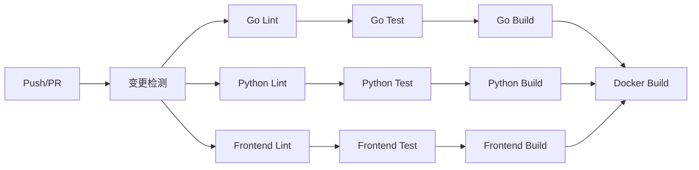

# CI/CD 流水线

## 📋 概述

本目录包含生成式推荐系统的完整 CI/CD 流水线配置，基于 GitHub Actions 实现自动化的代码检查、测试、构建和部署。

### 目录结构

```
ci-cd/
├── .github/
│   └── workflows/
│       ├── ci.yaml              # 持续集成
│       ├── cd-dev.yaml          # 开发环境部署
│       ├── cd-prod.yaml         # 生产环境部署
│       ├── security-scan.yaml   # 安全扫描
│       └── release.yaml         # 版本发布
├── scripts/
│   ├── build.sh                 # 构建脚本
│   ├── test.sh                  # 测试脚本
│   ├── deploy.sh                # 部署脚本
│   └── rollback.sh              # 回滚脚本
├── tests/
│   ├── test_build.bats          # 构建脚本测试
│   ├── test_deploy.bats         # 部署脚本测试
│   ├── test_rollback.bats       # 回滚脚本测试
│   ├── test_test.bats           # 测试脚本测试
│   ├── test_workflows.py        # 工作流配置测试
│   └── run_tests.sh             # 测试运行器
├── Makefile                     # 常用命令
└── README.md                    # 本文档
```

---

## 🚀 快速开始

### 前置条件

- Go 1.21+
- Python 3.10+
- Node.js 20+
- Docker 24+
- kubectl 1.28+

### 安装开发依赖

```bash
cd devops/ci-cd
make setup
```

### 常用命令

```bash
# 查看所有可用命令
make help

# 构建所有组件
make build

# 运行所有测试
make test

# 代码检查
make lint

# 生成覆盖率报告
make coverage

# 部署到开发环境
make deploy-dev

# 部署到生产环境 (金丝雀)
make deploy-prod
```

---

## 📦 GitHub Actions 工作流

### 1. 持续集成 (ci.yaml)

**触发条件:**
- 推送到 `main` 或 `develop` 分支
- 针对这两个分支的 Pull Request

**主要任务:**

| 阶段 | 任务 | 描述 |
|------|------|------|
| 变更检测 | changes | 检测代码变更范围 |
| Go 检查 | go-lint, go-test, go-build | 代码检查、测试、构建 |
| Python 检查 | python-lint, python-test, python-build | 代码检查、测试、构建 |
| 前端检查 | frontend-lint, frontend-test, frontend-build | 代码检查、测试、构建 |
| Docker 构建 | docker-build | 构建并推送 Docker 镜像 |

**示例流程:**



### 2. 开发环境部署 (cd-dev.yaml)

**触发条件:**
- 推送到 `develop` 分支
- 手动触发

**功能特性:**
- 自动构建 Docker 镜像
- 部署到 `recommend-dev` 命名空间
- Slack 通知

**手动触发参数:**

| 参数 | 描述 | 默认值 |
|------|------|--------|
| services | 指定部署的服务 | 全部服务 |
| skip_tests | 跳过测试 | false |

### 3. 生产环境部署 (cd-prod.yaml)

**触发条件:**
- 发布 Release
- 手动触发

**功能特性:**
- 安全扫描 (Trivy)
- 金丝雀发布
- 自动回滚
- Slack 通知

**部署流程:**

```
1. 安全扫描
   ↓
2. 预部署验证
   ↓
3. 金丝雀部署 (5%)
   ↓
4. 指标分析 (5分钟)
   ↓
5. 全量部署
   ↓
6. 清理金丝雀
```

**手动触发参数:**

| 参数 | 描述 | 默认值 |
|------|------|--------|
| version | 部署版本 | 必填 |
| canary_percentage | 金丝雀流量比例 | 5% |
| skip_canary | 跳过金丝雀 | false |
| rollback_on_failure | 失败自动回滚 | true |

### 4. 安全扫描 (security-scan.yaml)

**触发条件:**
- 每日凌晨 2 点定时执行
- PR 中修改依赖文件时
- 手动触发

**扫描内容:**

| 类型 | 工具 | 描述 |
|------|------|------|
| Go 依赖 | govulncheck, Nancy | 漏洞检测 |
| Python 依赖 | safety, pip-audit | 漏洞检测 |
| Node.js 依赖 | npm audit, Snyk | 漏洞检测 |
| 代码扫描 | Gosec, Bandit, Semgrep | SAST 分析 |
| 密钥检测 | TruffleHog, Gitleaks | 敏感信息检测 |
| 容器扫描 | Trivy, Grype, Dockle | 镜像漏洞检测 |
| IaC 扫描 | Checkov | Kubernetes 配置检查 |

### 5. 版本发布 (release.yaml)

**触发条件:**
- 手动触发

**功能特性:**
- 自动版本号递增
- 生成 Changelog
- 构建多平台二进制
- 构建多平台 Docker 镜像
- 创建 GitHub Release
- 更新 CHANGELOG.md

**版本类型:**

| 类型 | 示例 | 描述 |
|------|------|------|
| patch | 1.0.0 → 1.0.1 | 补丁版本 |
| minor | 1.0.0 → 1.1.0 | 次版本 |
| major | 1.0.0 → 2.0.0 | 主版本 |

---

## 🔧 脚本使用

### build.sh - 构建脚本

```bash
# 构建所有组件
./scripts/build.sh all

# 只构建 Go 服务
./scripts/build.sh go

# 构建 Docker 镜像并推送
./scripts/build.sh docker --push --registry myregistry.com

# 指定版本和平台
./scripts/build.sh docker --version v1.0.0 --platform linux/arm64
```

**支持的目标:**
- `go` - Go 服务
- `python` - Python 包
- `frontend` - 前端应用
- `docker` - Docker 镜像
- `all` - 全部 (默认)

### test.sh - 测试脚本

```bash
# 运行所有测试
./scripts/test.sh all

# 只运行 Go 测试，带竞态检测
./scripts/test.sh go --race

# 生成覆盖率报告
./scripts/test.sh all --coverage

# 包含集成测试
./scripts/test.sh all --integration
```

**选项:**
- `--coverage` - 生成覆盖率报告
- `--integration` - 包含集成测试
- `--race` - Go 竞态检测
- `--verbose` - 详细输出
- `--fail-fast` - 失败立即停止

### deploy.sh - 部署脚本

```bash
# 部署到开发环境
./scripts/deploy.sh dev

# 部署到生产环境，金丝雀模式
./scripts/deploy.sh prod --canary --canary-weight 10

# 指定版本和服务
./scripts/deploy.sh staging --version v1.0.0 --services recommend-service

# 试运行
./scripts/deploy.sh prod --dry-run
```

**环境:**
- `dev` - 开发环境 (recommend-dev)
- `staging` - 预发布环境 (recommend-staging)
- `prod` - 生产环境 (recommend-prod)

### rollback.sh - 回滚脚本

```bash
# 查看部署历史
./scripts/rollback.sh dev --history

# 回滚到上一版本
./scripts/rollback.sh prod

# 回滚到指定修订版本
./scripts/rollback.sh prod --revision 3

# 回滚到指定版本
./scripts/rollback.sh prod --version v1.0.0

# 试运行
./scripts/rollback.sh prod --dry-run
```

---

## 🔐 密钥配置

在 GitHub 仓库设置中配置以下 Secrets:

| Secret 名称 | 描述 | 必需 |
|-------------|------|------|
| DOCKER_REGISTRY_URL | Docker 镜像仓库地址 | ✅ |
| DOCKER_USERNAME | Docker 用户名 | ✅ |
| DOCKER_PASSWORD | Docker 密码 | ✅ |
| KUBECONFIG_DEV | 开发环境 kubeconfig (base64) | ✅ |
| KUBECONFIG_PROD | 生产环境 kubeconfig (base64) | ✅ |
| SLACK_WEBHOOK_URL | Slack 通知 Webhook | ✅ |
| CODECOV_TOKEN | Codecov 上传 Token | ❌ |
| SNYK_TOKEN | Snyk 扫描 Token | ❌ |
| GITLEAKS_LICENSE | Gitleaks 许可证 | ❌ |

### 生成 kubeconfig

```bash
# 导出并编码
kubectl config view --raw | base64
```

---

## 🧪 运行测试

### 安装测试依赖

```bash
# 安装 bats (Bash 测试框架)
npm install -g bats

# 或者使用 brew
brew install bats-core

# 安装 Python 依赖
pip install pytest pyyaml
```

### 运行测试

```bash
cd tests

# 运行所有测试
./run_tests.sh

# 只运行 Bash 脚本测试
./run_tests.sh --bats

# 只运行 Python 测试
./run_tests.sh --python

# 详细输出
./run_tests.sh --verbose
```

### 单独运行测试

```bash
# Bash 测试
bats test_build.bats

# Python 测试
pytest test_workflows.py -v
```

---

## 📊 接口契约

本 CI/CD 流水线实现了 `devops/interfaces.yaml` 中定义的以下契约:

### 工作流

```yaml
cicd:
  workflows:
    - name: ci.yaml           # ✅ 已实现
    - name: cd-dev.yaml       # ✅ 已实现
    - name: cd-prod.yaml      # ✅ 已实现
```

### 构建产物

```yaml
cicd:
  artifacts:
    - recommend-service:latest  # ✅ 已实现
    - user-service:latest       # ✅ 已实现
    - item-service:latest       # ✅ 已实现
    - ugt-inference:latest      # ✅ 已实现
```

### 密钥

```yaml
cicd:
  required_secrets:
    - DOCKER_REGISTRY_URL     # ✅ 已使用
    - DOCKER_USERNAME         # ✅ 已使用
    - DOCKER_PASSWORD         # ✅ 已使用
    - KUBECONFIG_DEV          # ✅ 已使用
    - KUBECONFIG_PROD         # ✅ 已使用
    - SLACK_WEBHOOK_URL       # ✅ 已使用
```

---

## 🔄 最佳实践

### 分支策略

```
main           # 生产就绪代码
  ├── develop  # 开发分支
  │     ├── feature/xxx  # 功能分支
  │     └── fix/xxx      # 修复分支
  └── release/v1.x       # 发布分支
```

### 提交规范

使用 [Conventional Commits](https://www.conventionalcommits.org/) 规范:

```
feat: 添加用户推荐功能
fix: 修复缓存失效问题
docs: 更新 API 文档
chore: 升级依赖版本
refactor: 重构推荐服务
test: 添加单元测试
```

### 版本发布流程

1. 创建 release 分支: `git checkout -b release/v1.0.0`
2. 运行测试: `make test`
3. 触发发布工作流
4. 合并到 main
5. 自动部署到生产环境

---

## 🐛 故障排除

### 常见问题

**Q: Docker 构建失败**

检查:
- Dockerfile 路径是否正确
- Docker 服务是否运行
- 镜像仓库认证是否正确

```bash
docker login ${REGISTRY}
```

**Q: 部署超时**

检查:
- Kubernetes 集群连接
- Pod 资源限制
- 镜像拉取策略

```bash
kubectl get pods -n recommend-dev
kubectl describe pod <pod-name> -n recommend-dev
```

**Q: 金丝雀部署失败**

检查:
- Prometheus 指标配置
- 错误率阈值设置
- 网络策略

```bash
./scripts/rollback.sh prod
```

---

## 📚 扩展阅读

- [GitHub Actions 文档](https://docs.github.com/en/actions)
- [Kubernetes 部署策略](https://kubernetes.io/docs/concepts/workloads/controllers/deployment/)
- [金丝雀发布](https://martinfowler.com/bliki/CanaryRelease.html)
- [12 Factor App](https://12factor.net/)

---

## 👥 贡献指南

1. Fork 本仓库
2. 创建功能分支
3. 编写代码和测试
4. 提交 Pull Request

请确保:
- 所有测试通过
- 代码符合规范
- 更新相关文档

---

## 📝 更新日志

### v1.0.0

- 初始版本
- 实现 CI/CD 基础工作流
- 添加安全扫描
- 支持金丝雀发布
- 完成单元测试

---

**维护者:** Person A - CI/CD 工程师  
**更新时间:** 2025-01-05

